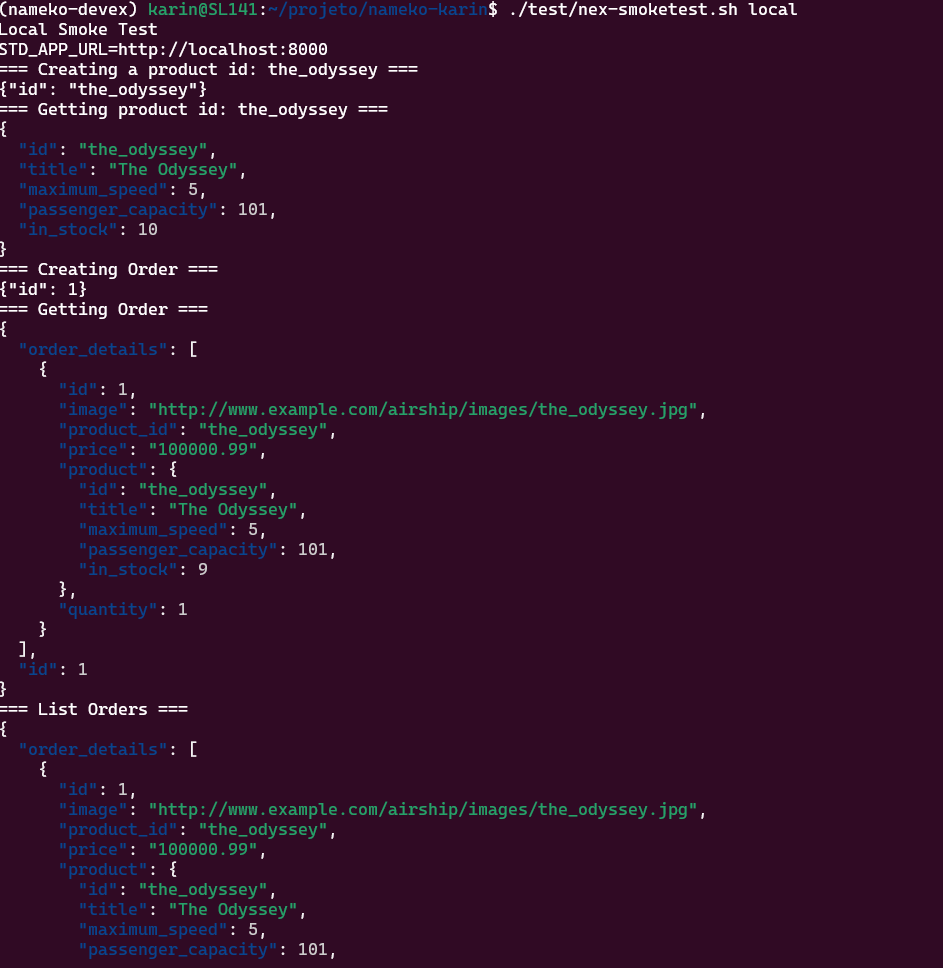
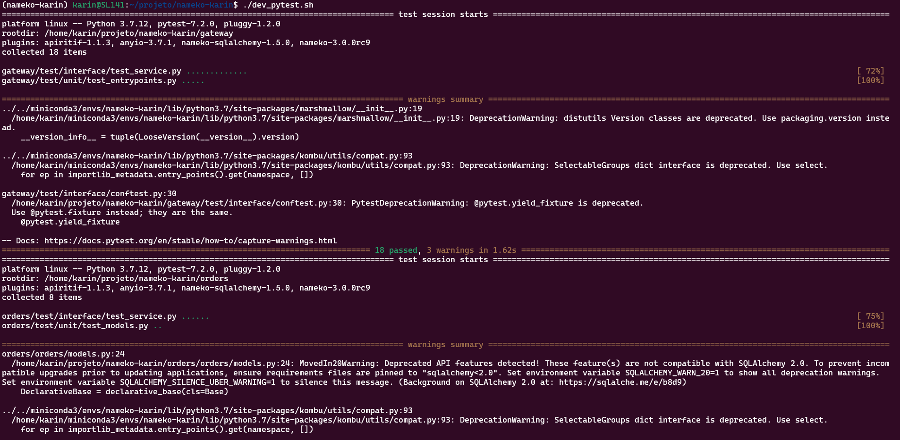
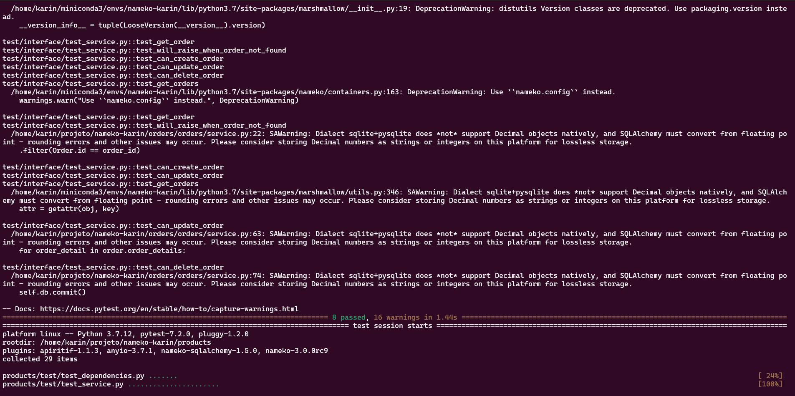

# Challenge

## 1.Follow README-DevEnv.md to setup dev environment for exercise
* Able to run locally, debug, unit-test <span style="color:green">OK</span>
* Able to smoke-test and performance test <span style="color:green">OK</span>
## 2.Do the following tasks:
* Enhance product service <span style="color:green">OK</span>
* Delete product rpc call <span style="color:green">OK</span>
* Wire into smoketest.sh <span style="color:green">OK</span>
* (bonus) Wire into perf-test <span style="color:green">OK</span>
* (bonus) Wire unit-test for this method <span style="color:green">OK</span>
* Enhance order service <span style="color:green">OK</span>
* List orders rpc call <span style="color:green">OK</span>
* Wire into smoketest.sh <span style="color:green">OK</span>
* (bonus) Wire into perf-test <span style="color:green">OK</span>
* (bonus) Wire unit-test for this method <span style="color:green">OK</span>
* Execute performance test <span style="color:green">OK</span>

### performance test before the enhancing

### performance test after the enhancing


### smoke test before adding delete product and list order

### smoke test after adding delete product and list order



### unit test before adding delete product and list order




## Questions:
* Question 1: Why is performance degrading as the test runs longer?
As the list of products grows, the get and create order functions become more and more burdensome, because in the get order it first uses the function of self.products_rpc.list() where this function searches all the columns of all the products and then searches for the product by the product_id of the order_details, while in the create order it uses the same function of self.products_rpc.list() and only uses the ids to check if the product_id of the order_details exists in the list.

* Question 2: How do you fix it?
Instead of using self.products_rpc.list() in the order get, it's better to use self.products_rpc.get(product_id) to avoid bringing in products that won't be used. Another point is to change self.products_rpc.list() in the order create to a new enpoint self.products_rpc.list_ids() where this function uses only client.keys instead of using client.hgetall for all keys.

* (bonus): Fix it
In addition to making the changes suggested in question 2, a pipeline was created to update the quantity of products.
```
   def decrement_stock(self, product_ids_quantities):
        response_dict = {}
        with self.client.pipeline() as pipe: 
            pipe.multi()
            for product_id, amount in product_ids_quantities.items():
                pipe.hincrby(self._format_key(product_id), 'in_stock', -amount)
                x = pipe.execute()
                response_dict[product_id] = x[0]
```
The entire code can be seen at the link: https://github.com/gitricko/nameko-devex/compare/master...karindoy:nameko-karin:master?diff=split