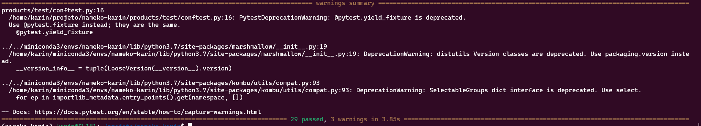

# Challenge

## 1.Follow README-DevEnv.md to setup dev environment for exercise
* Able to run locally, debug, unit-test OK
* Able to smoke-test and performance test OK
## 2.Do the following tasks:
* Enhance product service OK
* Delete product rpc call OK
* Wire into smoketest.sh OK
* (bonus) Wire into perf-test OK
* (bonus) Wire unit-test for this method OK
* Enhance order service OK
* List orders rpc call OK
* Wire into smoketest.sh OK
* (bonus) Wire into perf-test OK
* (bonus) Wire unit-test for this method OK
* Execute performance test OK

### performance test before the enhancing

### performance test after the enhancing

### smoke test before adding delete product and list order

### smoke test after adding delete product and list order

### unit test before adding delete product and list order

## Questions:
* Question 1: Why is performance degrading as the test run longer?
* Question 2: How do you fix it?
* (bonus): Fix it
